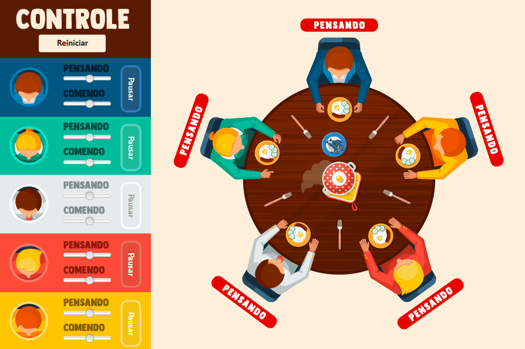

# Jantar dos Filósofos
 Este projeto foi concebido e implementado como parte da disciplina de Programação Concorrente, realizada durante o terceiro semestre do curso de Ciência da Computação na Universidade Estadual da Bahia (UESB), fazendo uso da linguagem de programação Java.

# Sobre

 O problema concorrente dos filósofos jantando envolve cinco filósofos em uma mesa redonda que alternam entre pensamento e comer. Eles compartilham garfos entre eles e só conseguem comer quando os garfos do seu lado estão disponíveis, mas isso pode levar a condições de corrida, bloqueio mútuo e inanição. Para resolver isso, foi utilizada uma solução clássica que envolve mecanismos de sincronização para garantir que os filósofos acessem os garfos de forma segura e coordenada.

 # Execução

Execução parcial do programa em funcionamento.

# Autores
[@CarlosGilM](https://github.com/CarlosGilM)
